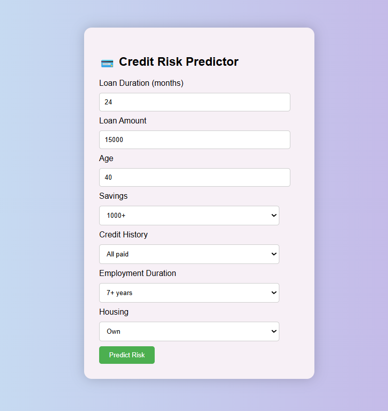
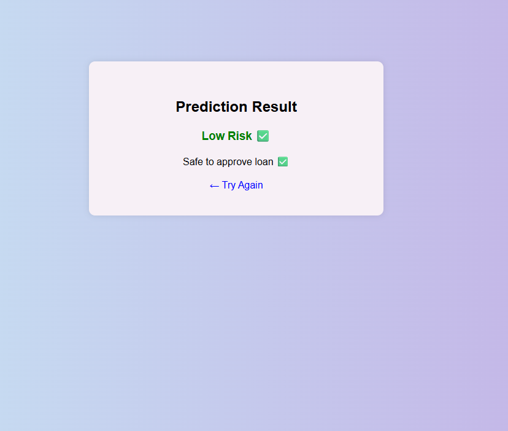

# 💳 Loan Risk Assessment System

A Machine Learning web application that predicts whether a borrower is high-risk or low-risk based on financial inputs.

## Features
- Real-time loan risk prediction
- Clean and user-friendly interface
- Optimized feature selection
- ML model integrated with Flask

## Tech Stack
- Python
- Scikit-learn
- Flask
- HTML/CSS

## Model Details
- Logistic Regression & Random Forest
- Evaluated using ROC-AUC
- Handles imbalanced dataset

## Key Insights
- Loan amount, age, and duration were among the most influential features affecting credit risk
- Logistic Regression performed better in detecting risky borrowers (higher recall for defaulters)
- Random Forest achieved higher overall accuracy and ROC-AUC but struggled with minority class detection
- Dataset imbalance impacted the model’s ability to identify high-risk borrowers effectively

## Use Case
This system can assist banks or financial institutions in assessing loan applications and identifying high-risk borrowers in real time.

## Run Locally
pip install flask pandas scikit-learn

python app.py

## Application Preview
### Home Page

### Prediction Result

